# 手写Semaphore

# 前言

已经毕业好多年了，自己还是个小菜鸟🐭。天天在公司写屎山💩，逐渐忘记优秀代码的模样，或者是从来没有知道过🤪。于是看看大佬的代码是怎么写的，清洗一下我那被屎山💩蒙蔽的双眼和脑袋。先挑个相对简单点的Semaphore看看

# Semaphore用法简介

我们可以先看看原生的Semaphore的基本用法，和核心方法，先大概了解它做了什么。

## 基本用法

```java
class Test {
    public static void main(String[] args) throws InterruptedException {
        //初始化3个资源
        Semaphore semaphore = new Semaphore(3);

        // 设置两秒后释放两个资源
        CompletableFuture.runAsync(() -> {
            try { TimeUnit.SECONDS.sleep(2); } catch (InterruptedException e) { throw new RuntimeException(e); }
            System.out.println("两秒后");
            semaphore.release(2);
        });

        for (int i = 0; i < 5; i++) {
            semaphore.acquire(1);
            System.out.println("i = " + i + "，成功获取资源，剩余资源数量 = " + semaphore.availablePermits()); // i = 2 时现在会阻塞 ，由于资源不足
        }
    }
}
```

结果如下：

```
i = 0，成功获取资源，剩余资源数量 = 2
i = 1，成功获取资源，剩余资源数量 = 1
i = 2，成功获取资源，剩余资源数量 = 0
两秒后
i = 3，成功获取资源，剩余资源数量 = 1
i = 4，成功获取资源，剩余资源数量 = 0
```

简单来说就是资源不足时会阻塞，无法往下执行；资源充足时会尝试唤醒线程，继续执行

## 核心方法

其实Semaphore 用法很简单， 核心方法也只有两个 ，acquire和release

- acquire
    - 作用：申请资源
        - 资源充足，则减少资源
        - 资源不足，线程阻塞并进入等待队列
- release
    - 释放资源
        - 资源增加，并尝试唤醒等待队列的线程

# 实现

通过上面的介绍，我们首先需要实现两个功能

- 资源控制，记录当前资源数量，和资源的加减
- 等待队列，用于记录等待资源的线程，实现两个功能
    - 出队：资源充足时唤醒线程并出队
    - 入队：线程申请资源时资源不足则入队

# 资源控制实现

## 版本零

先简单实现如下接口

```java
public abstract class AbstractSemaphore {

    protected int permits;

    /**
     * 资源尝试减少num , 有剩余则返回剩余，不足则返回负数且资源不变
     */
    abstract int tryAcquire(int num);

    /**
     * 资源permits增加num
     */
    abstract void tryRelease(int num);
}
```

## 版本一

只需要简单的加法即可，由于Semaphore一般用于多线程环境，多线程环境下对公共资源的操作会出现**竞态条件**的问题，有兴趣可自行了解，这里不再赘述

解决竞态条件的两个方案

- 加锁，使用synchronize 或者 ReentrantLock （性能一般，这里不使用）
- CAS （compare and set） + `volatile` , 即使用 AtomInteger 或者 `unsafe.compareAndSwapInt`

```java
public class MySemaphore1 extends AbstractSemaphore {

    protected int permits;

		@Override
    int tryAcquire(int num) {
        int remain = permits - num;
        if (remain > 0) {
            permits = remain;
        }
        return remain;
    }
    
    @Override
    void tryRelease(int num) {
        permits += num;
    }
}
```

## 版本二（CAS）

这里使用AtomInteger实现

```java
public class MySemaphore2 extends AbstractSemaphore {

    protected AtomicInteger permits;

    MySemaphore2(int num) {
        permits = new AtomicInteger(num);
    }

    @Override
    int tryAcquire(int num) {
        while (true) {
            int permit = permits.get();
            int remain = permit - num;
            if (remain < 0 || permits.compareAndSet(permit, remain)) {
                return remain;
            }
        }
    }

    @Override
    void tryRelease(int num) {
        while (true) {
            int permit = permits.get();
            int remain = permit + num;
            if (permits.compareAndSet(permit, remain)) {
                return;
            }
        }
    }
}
```

# 等待队列

虽然我们可以直接用`ConcurrentLinkedQueue`出于加深理解的目的，我们先动手写一个

## 功能

首先要明确我们要实现的队列有什么特点，需要什么功能

- FIFO（先进先出）, 即只需要实现两个方法即可
    - addLast：把元素添加到队列结尾
    - removeHead：把头元素去掉
- 双向链表

## 结构

其中队列用于保存阻塞的线程信息，用户唤醒线程

```mermaid

%%{
  init: {
    'theme': 'default',
    'fontFamily': 'system-ui'
  }
}%%

flowchart LR
    head["头部节点
    不保存任何信息"]
    tail["尾部节点
    thread2"]
    node["中间节点
    thread1"]

    head <--> node <--> tail
```



### 抽象类

```java
/**
 * 双向队列， 包含头尾指针和 addLast , removeHead方法
 */
public abstract class AbstractDeque {

    protected Node head;
    protected Node tail;

    /**
     * 节点类， 包含前后指针和线程
     */
    protected static class Node {
        Node prev;
        Node next;
        Thread thread;
        public Node(Thread thread) {
            this.thread = thread;
        }
    }
    public abstract void addLast(Node node);
    public abstract void removeHead();
    public int size(){
        int size = 0;
        Node node = head;
        while (node != null) {
            size++;
            node = node.next;
        }
        return size;
    }
}
```

### 实现-版本一

非线程安全的代码在多线程add 或者 remove有可能失效， 可以自行测试

```java
public class Deque1 extends AbstractDeque {

    /**
     * 先初始化一个空节点，头尾指针都指向这个节点
     */
    public Deque1(){
        head = new Node(null);
        tail = head;
    }

    public void addLast(Node node) {
        tail.next = node;
        node.prev = tail;
        tail = node;
    }

    public void removeHead(){
        Node oldHead = head;
        head = oldHead.next;
        oldHead.next = null;
        // 使新的头节点的线程设置为空
        head.thread = null;
    }

    /*测试代码*/
    public static void main(String[] args) throws Exception {
        Deque1 deque1 = new Deque1();
        for (int i = 0; i < 100; i++) {
            CompletableFuture.runAsync(() -> {
                try { deque1.addLast(new Node(Thread.currentThread()));
                } catch (Exception e) { }
            });
        }
        TimeUnit.SECONDS.sleep(2);
        // 这里的期望值包含头部的话应该是101，但实际可能是97，98等
        System.out.println(deque1.size());
    }
}
```

### 实现-版本二-线程安全队列

方法有两个

- 加锁 ，只需直接在方法增加synchronize ， 可以自行尝试
- CAS ， 可以使用`AtomicInteger` 或者 `Unsafe`

这里使用unsafe方法实现

1. 抽象类代码，这里其实只增加了4个 compareAndSet方法。需要注意的是使用unsafe需要反射获取

```java
/**
 * 双向队列， 包含头尾指针和 addLast , removeHead方法
 */
public abstract class AbstractDeque {

    protected Node head;
    protected Node tail;

    private static final Unsafe unsafe;
    static {
        try {
            Field f = Unsafe.class.getDeclaredField("theUnsafe");
            f.setAccessible(true);
            unsafe = (Unsafe) f.get(null);
        } catch (Exception e) {
            throw new RuntimeException(e);
        }
    }

    private static final long HEAD;
    private static final long TAIL;

    static {
        try {
            HEAD = unsafe.objectFieldOffset(AbstractDeque.class.getDeclaredField("head"));
            TAIL = unsafe.objectFieldOffset(AbstractDeque.class.getDeclaredField("tail"));
        } catch (NoSuchFieldException e) {
            throw new RuntimeException(e);
        }
    }
    public boolean compareAndSetHead(Node expect, Node update) {
        return unsafe.compareAndSwapObject(this, HEAD, expect, update);
    }
    public boolean compareAndSetTail(Node expect, Node update) {
        return unsafe.compareAndSwapObject(this, TAIL, expect, update);
    }

    /**
     * 节点类， 包含前后指针和线程
     */
    protected static class Node {
        Node prev;
        Node next;
        Thread thread;

        private static final long PREV;
        private static final long NEXT;

        static {
            try {
                PREV = unsafe.objectFieldOffset(Node.class.getDeclaredField("prev"));
                NEXT = unsafe.objectFieldOffset(Node.class.getDeclaredField("next"));
            } catch (NoSuchFieldException e) {
                throw new RuntimeException(e);
            }
        }
        public Node(Thread thread) {
            this.thread = thread;
        }
        public boolean compareAndSetPrev(Node expect, Node update) {
            return unsafe.compareAndSwapObject(this, PREV, expect, update);
        }
        public boolean compareAndSetNext(Node expect, Node update) {
            return unsafe.compareAndSwapObject(this, NEXT, expect, update);
        }

    }
    public abstract void addLast(Node node);
    public abstract void removeHead();
    public int size(){
        int size = 0;
        Node node = head;
        while (node != null) {
            size++;
            node = node.next;
        }
        return size;
    }
}
```

1. 实现代码

```java
public class Deque2 extends AbstractDeque {

    /**
     * 先初始化一个空节点，头尾指针都指向这个节点
     */
    public Deque2() {
        head = new Node(null);
        tail = head;
    }

    public void addLast(Node node) {
        while (true) {
            Node oldTail = tail;
            Node newTail = node;
            if (oldTail.compareAndSetNext(null, newTail)) {
                newTail.prev = oldTail;
                tail = newTail;
                return;
            }
        }
    }

    public void removeHead() {
        while (true) {
            Node oldHead = head;
            Node newHead = head.next;
            if (compareAndSetHead(oldHead, newHead)) {
                oldHead.next = null;
                newHead.prev = null;
                newHead.thread = null;
                return;
            }
        }
    }

    /*测试代码*/
    public static void main(String[] args) throws Exception {
        Deque2 deque1 = new Deque2();
        for (int i = 0; i < 100; i++) {
            CompletableFuture.runAsync(() -> {
                try {
                    deque1.addLast(new Node(Thread.currentThread()));
                } catch (Exception e) {
                }
            });
        }

        for (int i = 0; i < 50; i++) {
            CompletableFuture.runAsync(() -> {
                try {
                    deque1.removeHead();
                } catch (Exception e) {
                }
            });
        }
        TimeUnit.SECONDS.sleep(2);
        // 这里的期望值包含头部的话应该是51
        System.out.println(deque1.size());
    }
}
```

# 最终版本

到这里为止，我们已经实现了已经基本实现Semphore的核心功能

- 资源控制 Semaphore2
- 等待队列 Deque2

我们简单的把它们组合一下